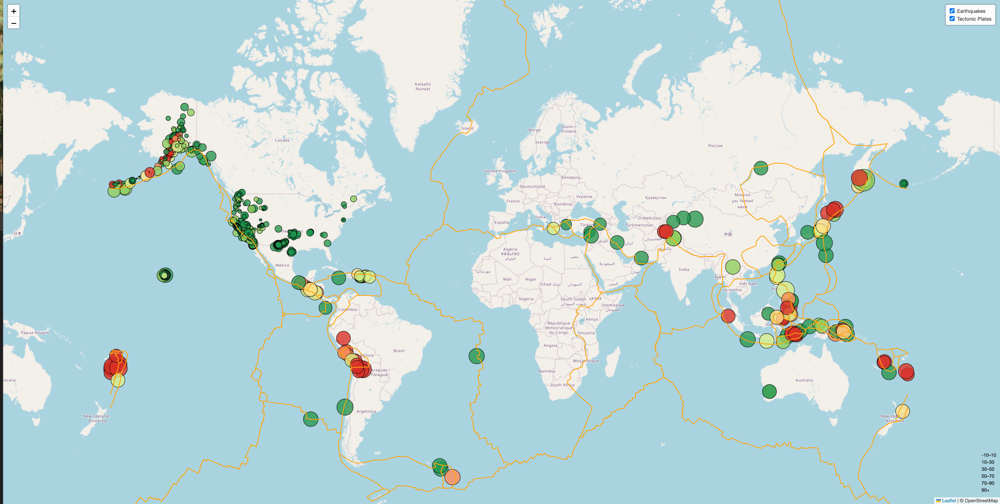

# Leaflet Earthquake Visualization



## Table of Contents
- [Overview](#overview)
- [Background](#background)
- [Features](#features)
- [Dataset](#dataset)
- [Technologies Used](#technologies-used)
- [Installation](#installation)
- [Usage](#usage)
- [Deployment](#deployment)
- [License](#license)
- [Acknowledgements](#acknowledgements)

## Overview
The **Leaflet Earthquake Visualization** is an interactive web application that visualizes earthquake data from around the world. The map dynamically displays recent earthquake activity, allowing users to explore the magnitude, depth, and location of seismic events. Additionally, tectonic plate boundaries are overlaid to provide context on the relationship between earthquakes and tectonic activity.

## Background
The United States Geological Survey, or USGS for short, is responsible for providing scientific data about natural hazards, the health of our ecosystems and environment, and the impacts of climate and land-use change. Their scientists develop new methods and tools to supply timely, relevant, and useful information about the Earth and its processes.

The USGS is interested in building a new set of tools that will allow them to visualize their earthquake data. They collect a massive amount of data from all over the world each day, but they lack a meaningful way of displaying it. In this challenge, you have been tasked with developing a way to visualize USGS data that will allow them to better educate the public and other government organizations (and hopefully secure more funding) on issues facing our planet.

This project is divided into two parts:

### Part 1: Create the Earthquake Visualization
In the first part of the challenge, the focus is on visualizing earthquake data provided by the USGS. The data, which is updated every 5 minutes, includes information on the magnitude, depth, and location of recent earthquakes around the world. 

**Key Objectives:**
- **Map Creation**: Using Leaflet, create an interactive map that plots all earthquakes from the selected dataset based on their longitude and latitude.
- **Data Markers**: The size of each marker should correspond to the magnitude of the earthquake, while the color should reflect the depth. Larger markers indicate more powerful earthquakes, and darker colors indicate deeper seismic events.
- **Popups and Legend**: Include popups with detailed information (such as magnitude, location, and depth) that appear when a marker is clicked. A legend is also added to help users interpret the color coding related to depth.

### Part 2: Gather and Plot More Data (Optional)
The second part of the challenge is an optional extension designed to explore the relationship between tectonic plates and seismic activity. By overlaying tectonic plate boundaries on the map, users can visually analyze how earthquake activity correlates with these geological features.

**Key Objectives:**
- **Tectonic Plate Boundaries**: Retrieve and plot tectonic plate boundary data alongside the earthquake data. This layer provides context to the seismic events by showing the edges of the Earth's tectonic plates.
- **Overlay Controls**: Implement layer controls that allow users to toggle the visibility of the earthquake data and the tectonic plate boundaries, providing a flexible and informative mapping experience.

This optional part not only enhances the visualization but also challenges your mapping and data integration skills by combining multiple datasets into a cohesive and interactive user interface.

## Features
- **Interactive Map**: Displays global earthquakes with markers scaled by magnitude and colored by depth.
- **Tectonic Plate Overlay**: Shows the boundaries of tectonic plates to correlate with seismic activity.
- **Dynamic Popups**: Each marker includes a popup with detailed information about the earthquake (location, magnitude, depth).
- **Layer Control**: Users can toggle between viewing earthquake data and tectonic plate boundaries.
- **Legend**: A color-coded legend helps users quickly interpret earthquake depths.

## Dataset
The data for this project is sourced from the United States Geological Survey (USGS) GeoJSON Feed, which provides real-time updates on seismic activity.

The datasets used include:
- **Earthquake Data**: Information about recent seismic events including their location, magnitude, depth, and more.
- **Tectonic Plate Boundaries**: GeoJSON data representing the boundaries of the Earth's tectonic plates.

## Technologies Used
- **Leaflet.js**: For creating the interactive map and handling layers and markers.
- **D3.js**: To fetch and manipulate the GeoJSON data.
- **HTML/CSS**: For structuring and styling the web application.
- **JavaScript**: For adding interactivity and dynamic data processing.
- **OpenStreetMap**: For the tile layer used as the base map.
- **GitHub Pages**: For deploying the project online.

## Installation
To run this project locally, follow these steps:

1. **Clone the Repository:**
   ```bash
   git clone https://github.com/maslla100/leaflet-challenge
   ```
2. **Navigate to the Project Directory:**
   ```bash
   cd leaflet-earthquake-visualization
   ```
3. **Open `index.html` in your Web Browser:**
   - You can directly open the `index.html` file in your browser to view the map locally.

## Usage
1. **Explore Earthquake Data:**
   - The map will automatically display earthquake data from the past week with markers representing magnitude and depth.
2. **Toggle Layers:**
   - Use the layer control to toggle the visibility of earthquake data and tectonic plate boundaries.
3. **Interpret the Data:**
   - Use the color-coded legend to understand the depth of the earthquakes and click on markers for more details.

## Deployment
The project is deployed on GitHub Pages. You can view the live map here:
- [Live Map](https://maslla100.github.io/leaflet-challenge/)

## License
This project is licensed under the MIT License. See the [LICENSE](LICENSE) file for more details.

## Acknowledgements
- **USGS**: For providing the earthquake data via the GeoJSON Feed.
- **OpenStreetMap**: For the base map tiles used in this project.
- **edX Data Analytics Bootcamp**: For the project guidelines and resources.
- **Leaflet.js** and **D3.js** communities: For the powerful libraries that made this project possible.

---

